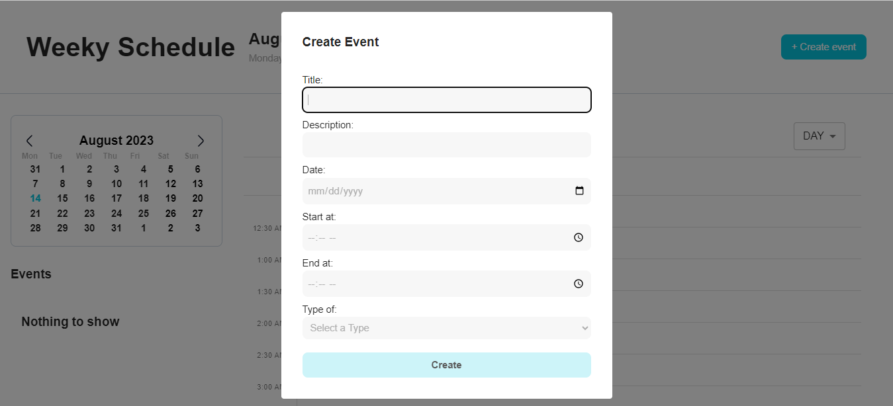

# Take-home assignment

| Position      | Front-end Development |
| ------------- | --------------------- |
| Assigned date | 9:00 AM, 13/8/2023    |
| Deadline      | 9:00 AM, 14/8/2023    |

<aside>
📆 Create a dashboard to manage weekly schedule

</aside>

# Required features:

- Include timetable
- Reference library: [react-big-calendar](https://www.npmjs.com/package/react-big-calendar)
- Can perform action Add, Edit & Delete on the timetable
- Has log in/sign up form (UI only, no need to be fully functioning)
- Clean code, project well structured

# Set up

- First of all you need to clone this project. Open your terminal

```cmd
git clone https://github.com/liamtran96/home-assignment-Smatyx.git
```

- And then open the folder that you just cloned and run the command

```cmd
pnpm install
```

This command will install necessary package to run the peoject

- Run command in order to run the project

```cmd
pnpm dev
```

# Image



